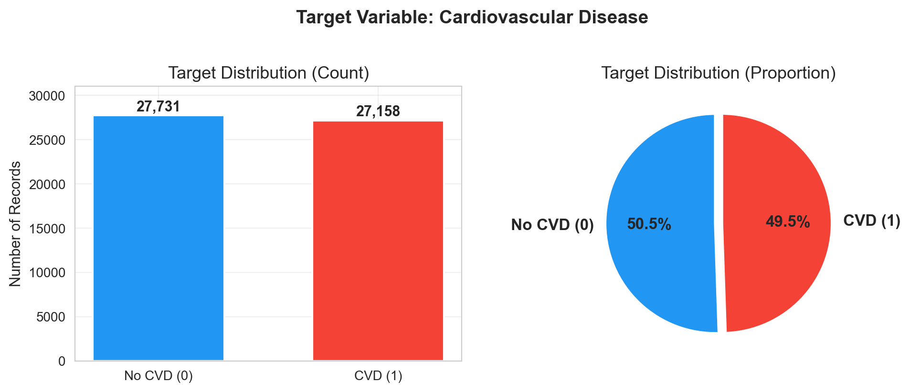
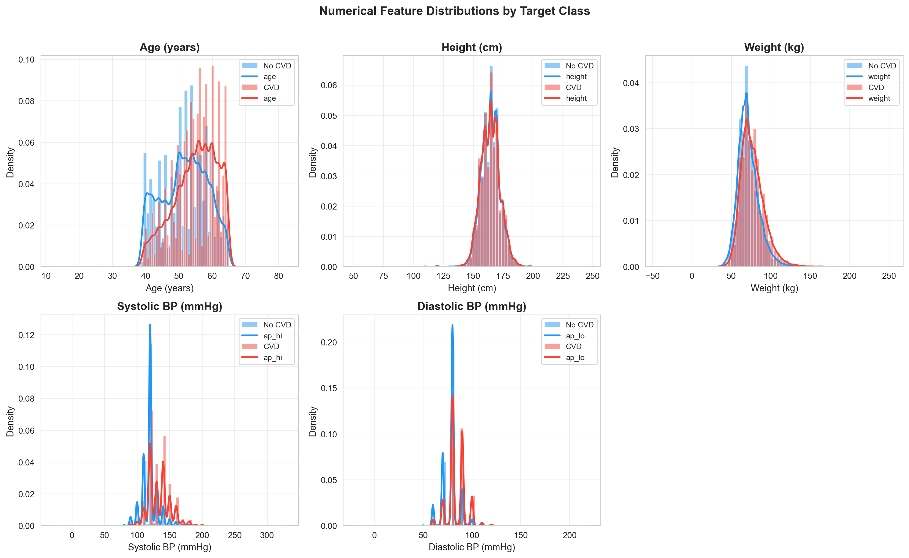
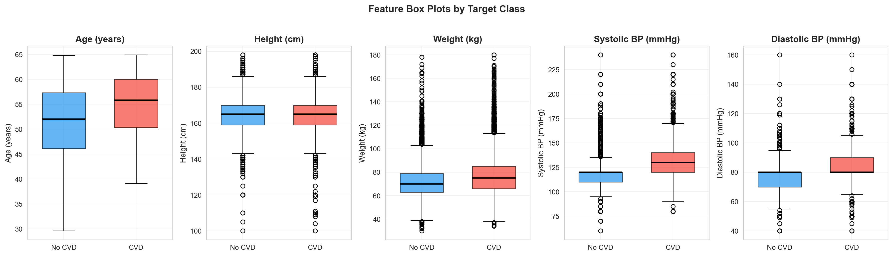
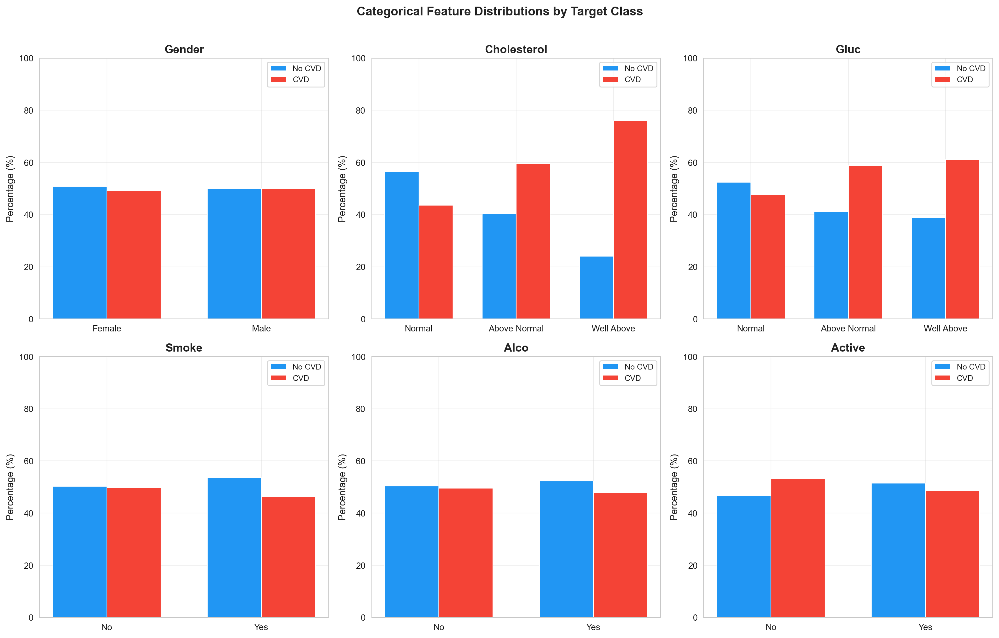
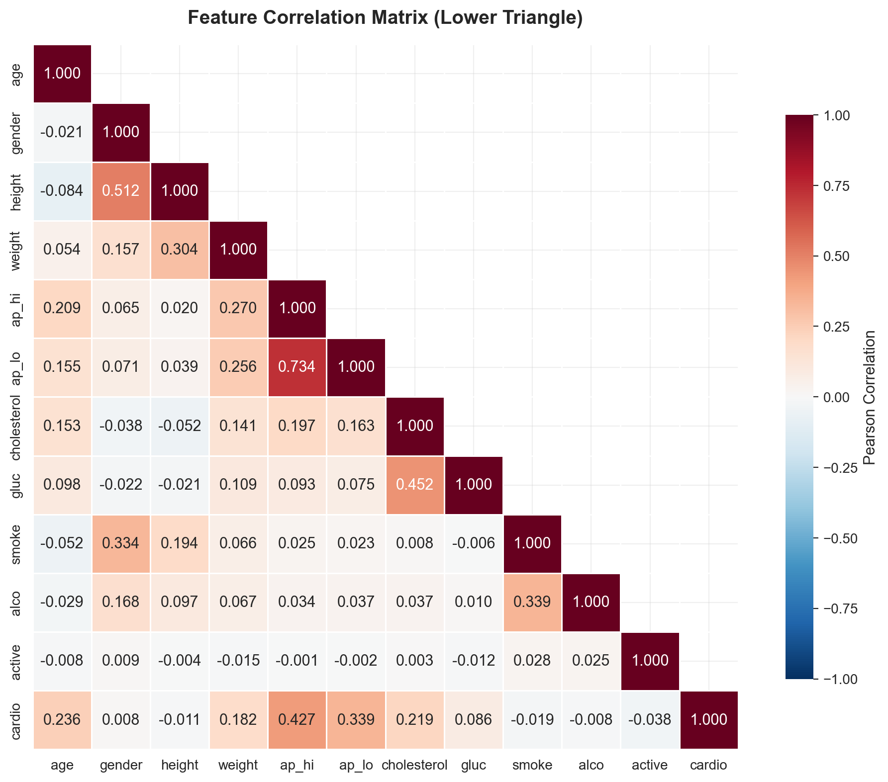
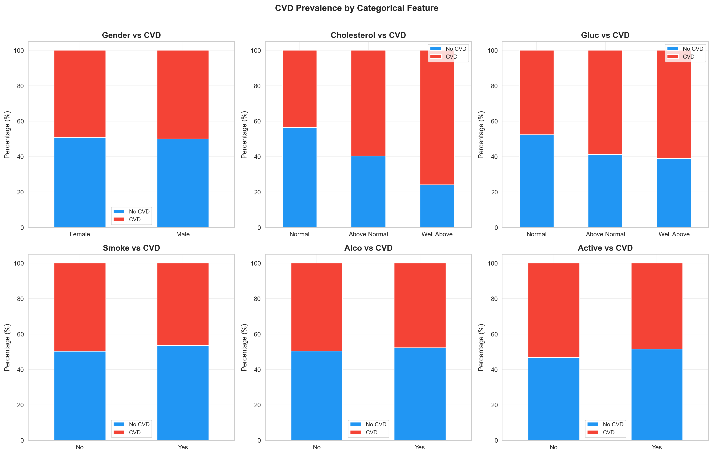

# Dataset Quality Assessment Report
## Cardiovascular Disease Dataset (Large — Training Set)

| Property | Value |
|---|---|
| Dataset | `large_train.csv` |
| Records | 54,889 |
| Features | 11 |
| Target | `cardio` |
| Assessment Date | 2026-08-26 |

---

## 1. Missing Values

> [!TIP]
> **Zero missing values** across all 54,889 records and 12 features.

## 2. Duplicate Records

| Metric | Value |
|---|---|
| Total records | 54,889 |
| Duplicate rows | 403 |
| Percentage | 0.73% |

> [!NOTE]
> 403 duplicate rows remain after preprocessing. These are clinically valid records (different patients with identical measurements) and are retained intentionally.

## 3. Target Variable — Class Distribution

| Class | Label | Count | Percentage |
|---|---|---|---|
| 0 | No CVD | 27,731 | 50.52% |
| 1 | CVD Present | 27,158 | 49.48% |

| Metric | Value |
|---|---|
| Imbalance ratio | 1.0211:1 |
| Balance assessment | Well balanced |

## 4. Numerical Feature Distributions

| Feature | Mean | Std | Min | 25% | Median | 75% | Max | Skewness | Kurtosis |
|---|---|---|---|---|---|---|---|---|---|
| age | 53.30 | 6.75 | 29.6 | 48.4 | 53.9 | 58.4 | 64.9 | -0.305 | -0.822 |
| height | 164.41 | 7.97 | 100.0 | 159.0 | 165.0 | 170.0 | 198.0 | -0.084 | 1.254 |
| weight | 74.13 | 14.30 | 30.0 | 65.0 | 72.0 | 82.0 | 180.0 | 0.992 | 2.355 |
| ap_hi | 126.68 | 16.70 | 60.0 | 120.0 | 120.0 | 140.0 | 240.0 | 0.935 | 1.892 |
| ap_lo | 81.29 | 9.41 | 40.0 | 80.0 | 80.0 | 90.0 | 160.0 | 0.313 | 1.694 |

### Normality Assessment (Shapiro-Wilk on 5000-sample subset)

| Feature | W-statistic | p-value | Normal? |
|---|---|---|---|
| age | 0.964436 | 2.10e-33 | No |
| height | 0.991407 | 7.34e-17 | No |
| weight | 0.950590 | 4.36e-38 | No |
| ap_hi | 0.910542 | 2.36e-47 | No |
| ap_lo | 0.887035 | 2.77e-51 | No |

## 5. Categorical Feature Distributions

### Gender

| Value | Label | Count | Percentage |
|---|---|---|---|
| 1 | Female | 35,671 | 64.99% |
| 2 | Male | 19,218 | 35.01% |

### Cholesterol

| Value | Label | Count | Percentage |
|---|---|---|---|
| 1 | Normal | 41,170 | 75.01% |
| 2 | Above Normal | 7,457 | 13.59% |
| 3 | Well Above | 6,262 | 11.41% |

### Gluc

| Value | Label | Count | Percentage |
|---|---|---|---|
| 1 | Normal | 46,698 | 85.08% |
| 2 | Above Normal | 4,052 | 7.38% |
| 3 | Well Above | 4,139 | 7.54% |

### Smoke

| Value | Label | Count | Percentage |
|---|---|---|---|
| 0 | No | 50,077 | 91.23% |
| 1 | Yes | 4,812 | 8.77% |

### Alco

| Value | Label | Count | Percentage |
|---|---|---|---|
| 0 | No | 51,968 | 94.68% |
| 1 | Yes | 2,921 | 5.32% |

### Active

| Value | Label | Count | Percentage |
|---|---|---|---|
| 0 | No | 10,853 | 19.77% |
| 1 | Yes | 44,036 | 80.23% |

## 6. Feature Ranges (After Preprocessing)

| Feature | Type | Min | Max | Range | Unique Values |
|---|---|---|---|---|---|
| age | Numerical | 29.6 | 64.9 | 35.3 | 261 |
| height | Numerical | 100.0 | 198.0 | 98.0 | 81 |
| weight | Numerical | 30.0 | 180.0 | 150.0 | 257 |
| ap_hi | Numerical | 60.0 | 240.0 | 180.0 | 106 |
| ap_lo | Numerical | 40.0 | 160.0 | 120.0 | 76 |
| gender | Categorical | 1 | 2 | — | 2 |
| cholesterol | Categorical | 1 | 3 | — | 3 |
| gluc | Categorical | 1 | 3 | — | 3 |
| smoke | Categorical | 0 | 1 | — | 2 |
| alco | Categorical | 0 | 1 | — | 2 |
| active | Categorical | 0 | 1 | — | 2 |

## 7. Feature Correlations

### Correlation with Target (`cardio`)

| Feature | Pearson r | Strength |
|---|---|---|
| ap_hi | 0.4274 | Strong |
| ap_lo | 0.3386 | Strong |
| age | 0.2362 | Moderate |
| cholesterol | 0.2187 | Moderate |
| weight | 0.1823 | Moderate |
| gluc | 0.0856 | Weak |
| active | -0.0379 | Weak |
| smoke | -0.0189 | Weak |
| height | -0.0106 | Weak |
| alco | -0.0085 | Weak |
| gender | 0.0080 | Weak |

### Notable Inter-Feature Correlations

| Feature Pair | Correlation | Interpretation |
|---|---|---|
| age ↔ ap_hi | 0.2093 | Positive — age increases with ap_hi |
| gender ↔ height | 0.5124 | Positive — gender increases with height |
| gender ↔ smoke | 0.3343 | Positive — gender increases with smoke |
| height ↔ weight | 0.3042 | Positive — height increases with weight |
| weight ↔ ap_hi | 0.2700 | Positive — weight increases with ap_hi |
| weight ↔ ap_lo | 0.2557 | Positive — weight increases with ap_lo |
| ap_hi ↔ ap_lo | 0.7343 | Positive — ap_hi increases with ap_lo |
| cholesterol ↔ gluc | 0.4522 | Positive — cholesterol increases with gluc |
| smoke ↔ alco | 0.3395 | Positive — smoke increases with alco |

## 8. Feature-Target Relationships

### Numerical Features — Mann-Whitney U Test

| Feature | Mean (No CVD) | Mean (CVD) | Difference | U-statistic | p-value | Significant? |
|---|---|---|---|---|---|---|
| age | 51.73 | 54.91 | +3.19 | 275295332 | 0.00e+00 | Yes (p < 0.001) |
| height | 164.50 | 164.33 | -0.17 | 381116446 | 1.40e-02 | Yes |
| weight | 71.55 | 76.77 | +5.22 | 296985700 | 0.00e+00 | Yes (p < 0.001) |
| ap_hi | 119.62 | 133.89 | +14.27 | 187981888 | 0.00e+00 | Yes (p < 0.001) |
| ap_lo | 78.14 | 84.51 | +6.38 | 233671924 | 0.00e+00 | Yes (p < 0.001) |

### Categorical Features — Chi-Square Test

| Feature | Chi² | p-value | Cramér's V | Significant? |
|---|---|---|---|---|
| gender | 3.45 | 6.32e-02 | 0.0079 | No |
| cholesterol | 2624.83 | 0.00e+00 | 0.2187 | Yes (p < 0.001) |
| gluc | 427.96 | 1.18e-93 | 0.0883 | Yes (p < 0.001) |
| smoke | 19.53 | 9.92e-06 | 0.0189 | Yes (p < 0.001) |
| alco | 3.87 | 4.90e-02 | 0.0084 | Yes |
| active | 78.61 | 7.55e-19 | 0.0378 | Yes (p < 0.001) |

### CVD Prevalence by Categorical Feature Value

**Gender:**

| Value | Label | CVD Rate |
|---|---|---|
| 1 | Female | 49.2% |
| 2 | Male | 50.0% |

**Cholesterol:**

| Value | Label | CVD Rate |
|---|---|---|
| 1 | Normal | 43.6% |
| 2 | Above Normal | 59.7% |
| 3 | Well Above | 75.9% |

**Gluc:**

| Value | Label | CVD Rate |
|---|---|---|
| 1 | Normal | 47.6% |
| 2 | Above Normal | 58.8% |
| 3 | Well Above | 61.1% |

**Smoke:**

| Value | Label | CVD Rate |
|---|---|---|
| 0 | No | 49.8% |
| 1 | Yes | 46.4% |

**Alco:**

| Value | Label | CVD Rate |
|---|---|---|
| 0 | No | 49.6% |
| 1 | Yes | 47.7% |

**Active:**

| Value | Label | CVD Rate |
|---|---|---|
| 0 | No | 53.3% |
| 1 | Yes | 48.5% |

## 9. Potential Data Quality Issues

> [!IMPORTANT]
> The dataset contains patients aged **29.6–64.9 years** only. Predictions for patients outside this range should be interpreted with caution.

### Identified Issues

1. **Low variance** in `smoke`: dominant class = 91.2%. Feature may have limited discriminative power.
2. **Low variance** in `alco`: dominant class = 94.7%. Feature may have limited discriminative power.
3. **Very weak correlation** between `active` and target: r = -0.0379. Feature may contribute minimal predictive value.
4. **Very weak correlation** between `smoke` and target: r = -0.0189. Feature may contribute minimal predictive value.
5. **Very weak correlation** between `height` and target: r = -0.0106. Feature may contribute minimal predictive value.
6. **Very weak correlation** between `alco` and target: r = -0.0085. Feature may contribute minimal predictive value.
7. **Very weak correlation** between `gender` and target: r = 0.0080. Feature may contribute minimal predictive value.
8. **High multicollinearity** between `ap_hi` and `ap_lo`: r = 0.7343. Consider feature selection or regularization.

## 10. CTGAN Suitability Assessment

| Criterion | Assessment | Details |
|---|---|---|
| Training records | 54,889 | Abundant for CTGAN |
| Numerical features | 5 | Good continuous distributions for CTGAN to learn |
| Categorical features | 6 | Mix of binary and ordinal |
| Missing values | 0 | No imputation needed before CTGAN |
| Class balance | 50.5% / 49.5% | Well balanced — CTGAN can learn both classes |
| Feature count | 11 | Manageable dimensionality |

> [!TIP]
> This dataset is **highly suitable for CTGAN**. The combination of 54,889 training records, 
> 5 numerical + 6 categorical features, balanced classes, and zero missing values 
> provides ideal conditions for synthetic tabular data generation.
