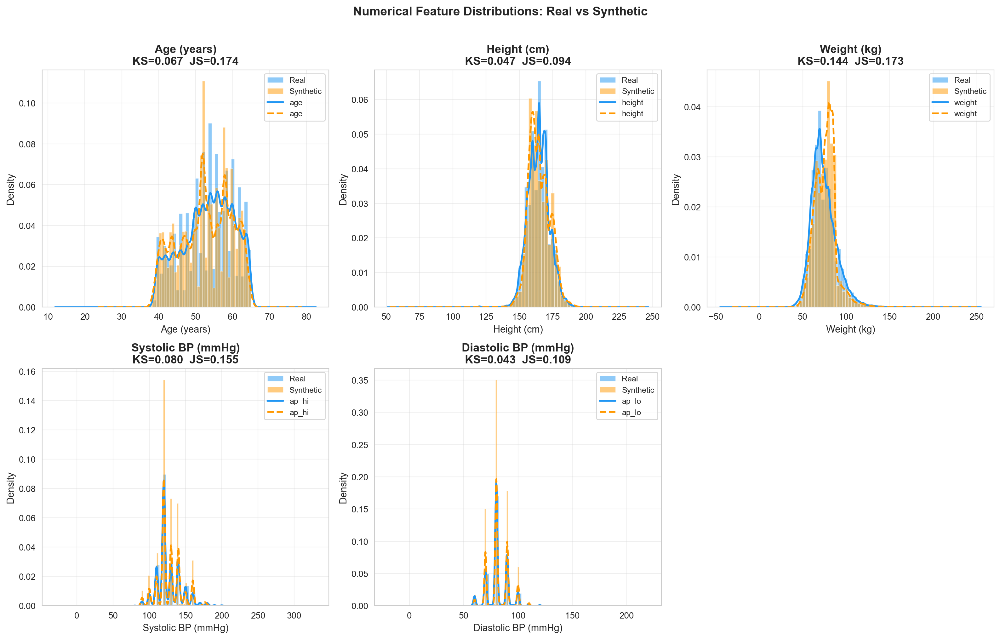
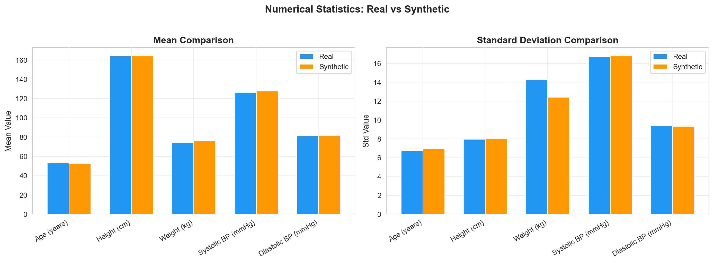
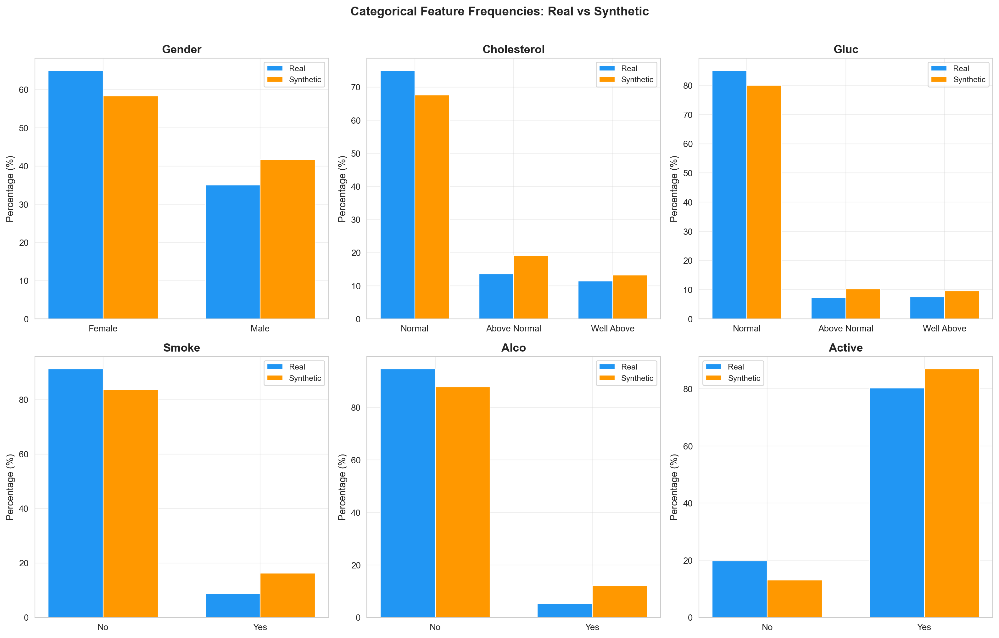
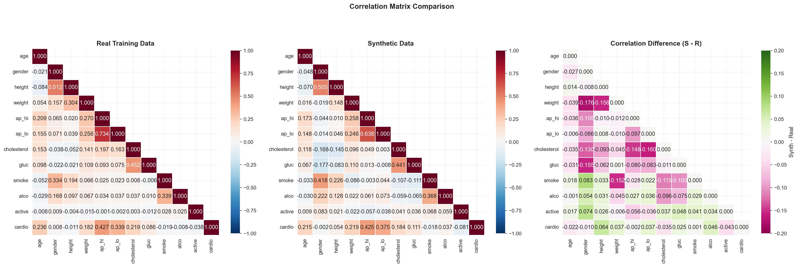
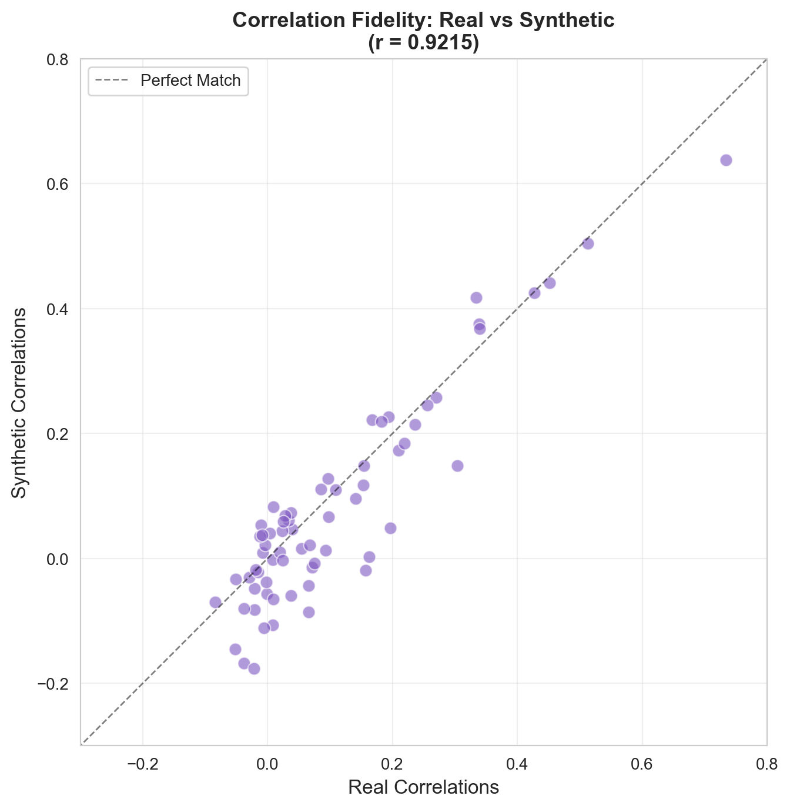
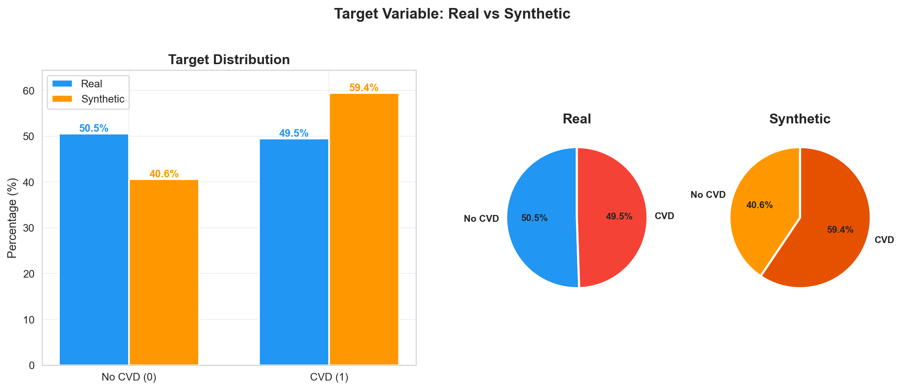
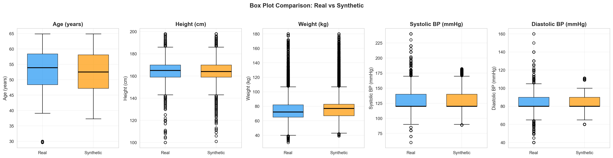
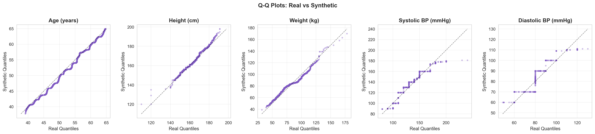

# Synthetic Data Quality Evaluation Report
## Real Training Data vs CTGAN Synthetic Data

| Property | Real Training | Synthetic |
|---|---|---|
| Source | `large_train.csv` | `large_synthetic_ctgan.csv` |
| Records | 54,889 | 109,778 |
| Features | 12 | 12 |
| Target | `cardio` | `cardio` |

---

## 1. Distribution Similarity (Numerical Features)

### Statistical Tests

| Feature | KS Statistic | KS p-value | Jensen-Shannon Div. | Verdict |
|---|---|---|---|---|
| age | 0.0674 | 8.05e-145 | 0.1742 | Good |
| height | 0.0475 | 3.56e-72 | 0.0945 | Excellent |
| weight | 0.1440 | 0.00e+00 | 0.1731 | Moderate |
| ap_hi | 0.0799 | 8.05e-204 | 0.1548 | Good |
| ap_lo | 0.0434 | 3.40e-60 | 0.1092 | Excellent |

> **Overall Distribution Quality**: Mean KS = 0.0764, Mean JS Divergence = 0.1412

## 2. Mean and Standard Deviation Comparison

| Feature | Real Mean | Synth Mean | Mean Diff | Real Std | Synth Std | Std Diff | Rel. Mean Error |
|---|---|---|---|---|---|---|---|
| age | 53.30 | 52.60 | -0.70 | 6.75 | 6.94 | +0.18 | 1.31% |
| height | 164.41 | 164.87 | +0.46 | 7.97 | 8.02 | +0.04 | 0.28% |
| weight | 74.13 | 76.05 | +1.91 | 14.30 | 12.43 | -1.88 | 2.58% |
| ap_hi | 126.68 | 127.95 | +1.27 | 16.70 | 16.87 | +0.18 | 1.00% |
| ap_lo | 81.29 | 81.79 | +0.50 | 9.41 | 9.35 | -0.07 | 0.61% |

> **Average Relative Mean Error**: 1.16%

## 3. Categorical Frequency Similarity

### Gender

| Value | Label | Real (%) | Synth (%) | Diff (pp) |
|---|---|---|---|---|
| 1 | Female | 64.99 | 58.34 | -6.65 |
| 2 | Male | 35.01 | 41.66 | +6.65 |

Chi-square goodness-of-fit: chi2 = 2130.5, p = 0.00e+00, Max deviation = 6.65 pp

### Cholesterol

| Value | Label | Real (%) | Synth (%) | Diff (pp) |
|---|---|---|---|---|
| 1 | Normal | 75.01 | 67.63 | -7.37 |
| 2 | Above Normal | 13.59 | 19.17 | +5.59 |
| 3 | Well Above | 11.41 | 13.20 | +1.79 |

Chi-square goodness-of-fit: chi2 = 3625.7, p = 0.00e+00, Max deviation = 7.37 pp

### Gluc

| Value | Label | Real (%) | Synth (%) | Diff (pp) |
|---|---|---|---|---|
| 1 | Normal | 85.08 | 80.05 | -5.03 |
| 2 | Above Normal | 7.38 | 10.32 | +2.94 |
| 3 | Well Above | 7.54 | 9.63 | +2.09 |

Chi-square goodness-of-fit: chi2 = 2243.2, p = 0.00e+00, Max deviation = 5.03 pp

### Smoke

| Value | Label | Real (%) | Synth (%) | Diff (pp) |
|---|---|---|---|---|
| 0 | No | 91.23 | 83.75 | -7.48 |
| 1 | Yes | 8.77 | 16.25 | +7.48 |

Chi-square goodness-of-fit: chi2 = 7682.4, p = 0.00e+00, Max deviation = 7.48 pp

### Alco

| Value | Label | Real (%) | Synth (%) | Diff (pp) |
|---|---|---|---|---|
| 0 | No | 94.68 | 87.90 | -6.78 |
| 1 | Yes | 5.32 | 12.10 | +6.78 |

Chi-square goodness-of-fit: chi2 = 10015.8, p = 0.00e+00, Max deviation = 6.78 pp

### Active

| Value | Label | Real (%) | Synth (%) | Diff (pp) |
|---|---|---|---|---|
| 0 | No | 19.77 | 13.07 | -6.70 |
| 1 | Yes | 80.23 | 86.93 | +6.70 |

Chi-square goodness-of-fit: chi2 = 3110.7, p = 0.00e+00, Max deviation = 6.70 pp

## 4. Correlation Similarity

### Overall Correlation Similarity Metrics

| Metric | Value | Interpretation |
|---|---|---|
| Mean Absolute Error | 0.0526 | Moderate |
| RMSE | 0.0693 | Good |
| Max Absolute Error | 0.1757 | Worst-case pair |
| Pearson (real vs synth corrs) | 0.9215 | Good |

### Key Feature-Pair Correlations

| Feature Pair | Real r | Synth r | Abs. Diff | Quality |
|---|---|---|---|---|
| ap_hi -- cardio | 0.4274 | 0.4253 | 0.0021 | Excellent |
| ap_lo -- cardio | 0.3386 | 0.3754 | 0.0368 | Good |
| age -- cardio | 0.2362 | 0.2146 | 0.0216 | Good |
| cholesterol -- cardio | 0.2187 | 0.1841 | 0.0346 | Good |
| weight -- cardio | 0.1823 | 0.2194 | 0.0371 | Good |
| gluc -- cardio | 0.0856 | 0.1106 | 0.0250 | Good |
| ap_hi -- ap_lo | 0.7343 | 0.6378 | 0.0966 | Moderate |
| cholesterol -- gluc | 0.4522 | 0.4411 | 0.0110 | Excellent |
| height -- weight | 0.3042 | 0.1484 | 0.1559 | Poor |
| gender -- height | 0.5124 | 0.5047 | 0.0078 | Excellent |
| weight -- ap_hi | 0.2700 | 0.2578 | 0.0122 | Excellent |
| weight -- ap_lo | 0.2557 | 0.2459 | 0.0098 | Excellent |
| smoke -- alco | 0.3395 | 0.3680 | 0.0285 | Good |
| age -- ap_hi | 0.2093 | 0.1733 | 0.0360 | Good |

## 5. Target Distribution Similarity

| Class | Label | Real (%) | Synth (%) | Diff (pp) |
|---|---|---|---|---|
| 0 | No CVD | 50.52 | 40.58 | -9.94 |
| 1 | CVD | 49.48 | 59.42 | +9.94 |

> **Target balance drift**: 9.94 percentage points (Moderate)

> [!WARNING]
> CTGAN over-generates the CVD class by 9.9 pp. 
> When augmenting, use controlled blending ratios (e.g., 50-100%) to keep the combined dataset close to the original distribution.

## 6. Feature Range Validity

### Numerical Features

| Feature | Real Min | Real Max | Synth Min | Synth Max | Min Valid? | Max Valid? | Range Coverage |
|---|---|---|---|---|---|---|---|
| age | 29.6 | 64.9 | 37.3 | 64.9 | Yes | Yes | 78.2% |
| height | 100.0 | 198.0 | 101.0 | 198.0 | Yes | Yes | 99.0% |
| weight | 30.0 | 180.0 | 39.0 | 180.0 | Yes | Yes | 94.0% |
| ap_hi | 60.0 | 240.0 | 89.0 | 182.0 | Yes | Yes | 51.7% |
| ap_lo | 40.0 | 160.0 | 60.0 | 111.0 | Yes | Yes | 42.5% |

### Categorical Features

| Feature | Real Values | Synth Values | Valid? |
|---|---|---|---|
| gender | [np.int64(1), np.int64(2)] | [np.int64(1), np.int64(2)] | Yes |
| cholesterol | [np.int64(1), np.int64(2), np.int64(3)] | [np.int64(1), np.int64(2), np.int64(3)] | Yes |
| gluc | [np.int64(1), np.int64(2), np.int64(3)] | [np.int64(1), np.int64(2), np.int64(3)] | Yes |
| smoke | [np.int64(0), np.int64(1)] | [np.int64(0), np.int64(1)] | Yes |
| alco | [np.int64(0), np.int64(1)] | [np.int64(0), np.int64(1)] | Yes |
| active | [np.int64(0), np.int64(1)] | [np.int64(0), np.int64(1)] | Yes |

## 7. Duplicate and Suspicious Records

| Metric | Count | Percentage | Assessment |
|---|---|---|---|
| Duplicate rows in synthetic | 599 | 0.55% | Acceptable |
| Exact copies of real records | 452 | 0.4117% | Good (low memorization) |

> [!TIP]
> Only 0.4117% of synthetic records are exact copies of real training data. This indicates CTGAN is **generating novel records**, not memorizing the training set.

### Clinical Plausibility Check

| Check | Count | Percentage |
|---|---|---|
| Diastolic >= Systolic BP | 134 | 0.12% |

> [!WARNING]
> 134 synthetic records have diastolic BP >= systolic BP, which is clinically implausible. Consider post-filtering these records before augmentation.

## 8. Overall Statistical Similarity

### Percentile Comparison

| Feature | Percentile | Real | Synthetic | Abs. Diff |
|---|---|---|---|---|
| age | P5 | 41.3 | 40.6 | 0.7 |
| age | P25 | 48.4 | 47.2 | 1.2 |
| age | P50 | 53.9 | 52.5 | 1.4 |
| age | P75 | 58.4 | 58.1 | 0.3 |
| age | P95 | 63.7 | 62.9 | 0.8 |
| height | P5 | 152.0 | 154.0 | 2.0 |
| height | P25 | 159.0 | 159.0 | 0.0 |
| height | P50 | 165.0 | 164.0 | 1.0 |
| height | P75 | 170.0 | 170.0 | 0.0 |
| height | P95 | 178.0 | 178.0 | 0.0 |
| weight | P5 | 55.0 | 57.0 | 2.0 |
| weight | P25 | 65.0 | 67.0 | 2.0 |
| weight | P50 | 72.0 | 77.0 | 5.0 |
| weight | P75 | 82.0 | 83.0 | 1.0 |
| weight | P95 | 100.0 | 96.0 | 4.0 |
| ap_hi | P5 | 100.0 | 100.0 | 0.0 |
| ap_hi | P25 | 120.0 | 120.0 | 0.0 |
| ap_hi | P50 | 120.0 | 120.0 | 0.0 |
| ap_hi | P75 | 140.0 | 140.0 | 0.0 |
| ap_hi | P95 | 160.0 | 160.0 | 0.0 |
| ap_lo | P5 | 70.0 | 70.0 | 0.0 |
| ap_lo | P25 | 80.0 | 80.0 | 0.0 |
| ap_lo | P50 | 80.0 | 80.0 | 0.0 |
| ap_lo | P75 | 90.0 | 90.0 | 0.0 |
| ap_lo | P95 | 100.0 | 100.0 | 0.0 |

### Shape Comparison (Skewness & Kurtosis)

| Feature | Real Skew | Synth Skew | Skew Diff | Real Kurt | Synth Kurt | Kurt Diff |
|---|---|---|---|---|---|---|
| age | -0.305 | -0.228 | +0.077 | -0.822 | -0.977 | -0.155 |
| height | -0.084 | 0.246 | +0.330 | 1.254 | 0.440 | -0.814 |
| weight | 0.992 | 0.985 | -0.006 | 2.355 | 4.181 | +1.827 |
| ap_hi | 0.935 | 0.418 | -0.517 | 1.892 | 0.338 | -1.554 |
| ap_lo | 0.313 | 0.320 | +0.007 | 1.694 | 0.183 | -1.512 |

## 9. Summary Scorecard

| Criterion | Score | Details |
|---|---|---|
| Distribution Similarity | B (Good) | Mean KS = 0.0764 |
| Correlation Fidelity | B (Good) | Pearson = 0.9215 |
| Mean Accuracy | B (Good) | Avg. relative error = 1.16% |
| Target Balance | C (Moderate) | Drift = 9.9 pp |
| Range Validity | A (Excellent) | All features within bounds |
| Privacy (low memorization) | A (Excellent) | 0.4117% exact copies |

## 10. Strengths and Weaknesses

### Strengths

- Numerical distributions are well-reproduced (mean KS = 0.0764)
- Strong correlation structure preservation (Pearson = 0.9215)
- All synthetic values fall within real training data ranges
- Very low memorization rate (0.4117% exact copies) -- generates novel records
- Mean values well-preserved (avg relative error = 1.16%)
- Zero missing values in synthetic data

### Weaknesses

- Target class imbalance drift: CVD over-generated by 9.9 pp
- `smoke` minority class over-generated by 7.5 pp (GAN mode smoothing)
- `alco` minority class over-generated by 6.8 pp (GAN mode smoothing)
- ap_hi-ap_lo correlation degraded by 0.097 (from 0.734 to 0.638)
- 134 records with clinically invalid BP (diastolic >= systolic)
- `ap_hi` range coverage only 52% -- tails under-represented
- `ap_lo` range coverage only 42% -- tails under-represented

### Recommendations for Augmentation

1. **Use controlled blending ratios** (50-100%) to mitigate target drift
2. **Post-filter** clinically invalid records (diastolic >= systolic) if present
3. **Monitor** sparse feature distributions (smoke, alco) in the augmented blend
4. **Verify** that model performance improves with augmentation on a validation set
